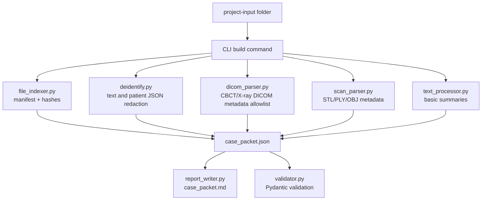
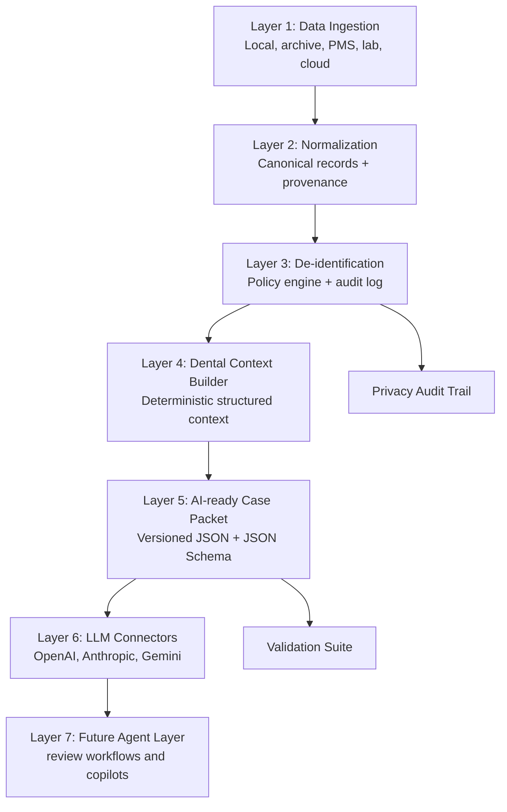

# Architecture Review

> Historical note: This document is a legacy DCS / dental packet infrastructure artifact from the project's earlier phase. The current primary repository identity is Clinical Cognition Transformation Lab (CCTL), which studies how clinical cognition transforms in distributed human-AI healthcare systems. This file is preserved for historical and technical context, not as the current primary mission statement.

## Executive Summary

`ai-ready-dental-case-packet` is currently a working local CLI that builds a de-identified Dental Case Packet from a folder of dental records. It is intentionally conservative: it does not diagnose, does not recommend treatment, and only transforms available data into structured context for dentist review.

The current architecture is a strong MVP, but it is still a packet builder rather than a full AI-native dental data infrastructure layer. The next version should formalize ingestion, normalization, de-identification, context building, packet validation, and connector boundaries.

## Current Architecture Diagram



## What Works Today

- Local-first CLI.
- Pydantic schema validation.
- DICOM metadata allowlist for core non-sensitive tags.
- PHI field detection logs without raw PHI values.
- File manifest with SHA-256 hashes.
- Mesh parser for STL, PLY, and OBJ via `trimesh`.
- Markdown report for dentist and AI-review workflows.
- Explicit non-diagnostic LLM prompt context.

## Weaknesses

- The pipeline is orchestrated directly inside `cli.py`.
- Ingestion, normalization, and context-building concepts are implicit rather than formal modules.
- `case_packet.json` is a code schema, not yet a formal public standard with versioned compatibility rules.
- De-identification is shallow for free text and does not yet include a robust PHI detection model or locale-specific PHI patterns.
- DICOM de-identification does not rewrite DICOM files; it only avoids exporting sensitive metadata.
- PDF ingestion is not implemented.
- Image thumbnail generation is not implemented despite the `thumbnails/` output folder.
- The current markdown report is useful, but not yet generated from a reusable renderer contract.

## Scalability Issues

- Large DICOM studies may contain many files; current parsing is synchronous and single-process.
- No batch mode or resumable processing exists.
- No persistent packet registry or content-addressable storage exists.
- File indexing and parsing are coupled to local filesystem paths.
- No plugin interface exists for PMS, EHR, lab files, or cloud object storage.
- No streaming parser boundary exists for large PDFs, imaging series, or archives.

## Technical Debt

- `cli.py` owns too much orchestration logic.
- `known_information` currently stores internal keys instead of richer record descriptors.
- There is no packet version field.
- There is no explicit provenance model per field.
- No machine-readable JSON Schema artifact is emitted.
- No structured warning codes exist; warnings are currently strings.
- De-identified copies do not preserve a formal mapping between source and output artifacts.

## Missing Modules

- `ingestion`: source adapters for local folder, archive, cloud storage, PMS, and lab systems.
- `normalization`: canonical metadata records across DICOM, images, mesh, text, and PDF.
- `context_builder`: deterministic case context construction independent of CLI.
- `packet_spec`: versioned JSON Schema export and compatibility checks.
- `privacy`: PHI policy engine, locale profiles, and audit events.
- `thumbnails`: DICOM and image thumbnail service.
- `connectors`: optional OpenAI, Anthropic, and Gemini prompt adapters.
- `rag`: chunking, indexing, and retrieval contracts for dental records.
- `agents`: future review workflow SDK, explicitly non-diagnostic by default.

## Security Concerns

- No encrypted output option.
- No secure temp-file handling policy.
- Logs may reveal filenames that contain PHI.
- De-identified copies may include original non-DICOM image pixels; photos can contain faces or identifying marks.
- Mesh and DICOM files may contain embedded private tags or comments not covered by the current allowlist.
- The CLI does not warn when output is written into synced cloud folders.
- No SBOM, dependency audit workflow, or release signing exists.

## PHI Exposure Risks

- Patient names can appear inside filenames.
- Clinical notes can include names, phone numbers, addresses, dates, clinic names, doctor names, and record numbers.
- DICOM private tags may contain sensitive metadata.
- Pixel data can contain burned-in annotations.
- Photos can reveal patient identity.
- PDFs can contain hidden text, metadata, or embedded images.
- The markdown report and logs are human-readable outputs and should be treated as sensitive.

## Recommended Architecture v2



## Recommended Module Boundaries

```text
dental_packet/
  ingestion/
    local_folder.py
    dicom.py
    mesh.py
    image.py
    text.py
    pdf.py
  normalization/
    models.py
    normalizer.py
  privacy/
    policy.py
    deidentifier.py
    audit.py
  context/
    builder.py
    prompts.py
  spec/
    packet_v0_1.py
    json_schema.py
  connectors/
    openai.py
    anthropic.py
    gemini.py
  agents/
    review_workflow.py
```

## Implementation Recommendations

1. Add `packet_version` and `schema_url` to every packet.
2. Emit a JSON Schema file for every released packet version.
3. Introduce structured warnings with stable codes.
4. Move orchestration out of `cli.py` into a `Pipeline` service.
5. Treat filenames as possible PHI and add optional path redaction.
6. Add DICOM burned-in annotation detection warnings.
7. Add configurable privacy profiles for US HIPAA, EU GDPR, and Taiwan workflows.
8. Add snapshot tests for packet compatibility.
9. Add CI with lint, tests, packaging, and dependency review.
10. Keep all LLM connectors optional and non-diagnostic.

## Non-Goals

- Automatic diagnosis.
- Treatment recommendations.
- Clinical accuracy claims.
- Replacing dentist review.
- Training a dental foundation model inside this repository.
